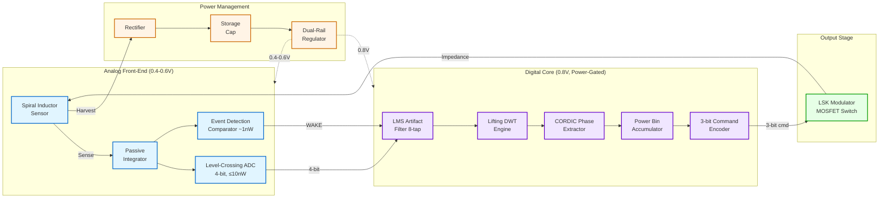
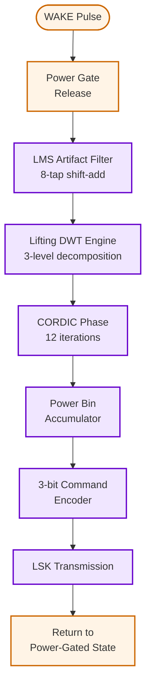
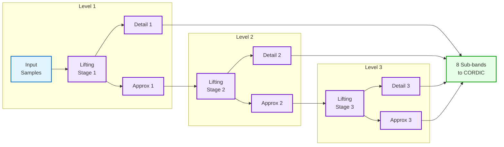
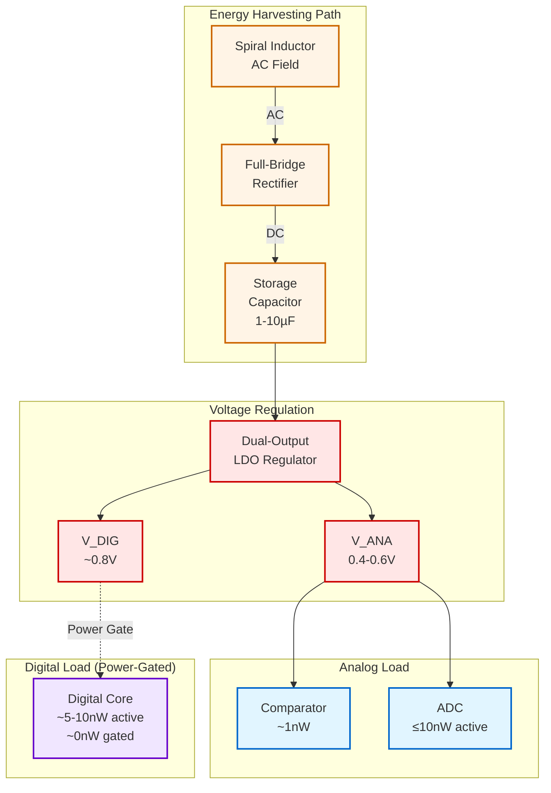

# Ultra-Low-Power Magnetic Field Sensing System Specification
## NeuroCore Field Sensor with Energy Harvesting and Closed-Loop Feedback

**Document Version:** 1.0  
**Date:** 2024  
**Author:** Design Team  
**Status:** Draft for Review

---

## Table of Contents
1. [Introduction](#1-introduction)
2. [Feature Summary](#2-feature-summary)
3. [Functional Description](#3-functional-description)
4. [Interface Description](#4-interface-description)
5. [Parameterization Options](#5-parameterization-options)
6. [Register Description](#6-register-description)
7. [Design Guidelines](#7-design-guidelines)
8. [Timing Diagram](#8-timing-diagram)

---

## 1. Introduction

### 1.1 Overview

The NeuroCore Field Sensor is an ultra-low-power, energy-harvesting system-on-chip designed for magnetic field sensing applications with closed-loop feedback capability. The system achieves sub-20nW peak active power and ~1nW always-on power through aggressive power gating, event-driven processing, and sub-threshold operation.

**Key Innovation:** This design represents the first demonstration of a closed-loop feedback system using Load Shift Keying (LSK) modulation in a sub-10nW power envelope, enabling bidirectional communication between an implantable/wearable sensor and external equipment.

### 1.2 Target Application

- Magnetic field-based biomedical sensing
- Closed-loop control of external medical equipment
- Ultra-low-power wearable/implantable systems
- Energy-harvesting sensor nodes

### 1.3 Key Features

- **Ultra-Low Power:** <1nW idle, <20nW peak active
- **Energy Harvesting:** Dual-purpose spiral inductor for sensing and power
- **Event-Driven Architecture:** Zero static power in digital domain
- **Sub-Threshold Operation:** 0.4-0.6V analog, 0.8V digital
- **Closed-Loop Feedback:** 3-bit command encoding via LSK modulation
- **Single-Channel Design:** Optimized for absolute minimum power

### 1.4 Competitive Positioning

This work targets a different application space than multi-channel neural recording systems (e.g., ISSCC 2025 64-channel systems), focusing on single-channel field sensing with novel closed-loop feedback architecture. See [Section 2.3](#23-benchmark-comparison) for detailed comparison.

---

## 2. Feature Summary

### 2.1 Requirements Table

| REQ_ID | Title | Type | Acceptance Criteria |
|--------|-------|------|---------------------|
| REQ_001 | Spiral inductor sensor interface | Functional | Dual-purpose inductor for sensing and energy harvesting |
| REQ_002 | Passive integrator front-end | Functional | Analog signal conditioning before ADC |
| REQ_003 | 4-bit level-crossing ADC | Performance | Dynamic inverter-based, non-uniform CT sampling, 4nW active, ~0nW idle |
| REQ_004 | Event detection comparator | Power | Coarse threshold comparator, ~1nW always-on operation |
| REQ_005 | WAKE pulse generation | Functional | Trigger digital core from sleep on event detection |
| REQ_006 | Power-gated digital core | Power | Digital processing blocks with power gating capability |
| REQ_007 | LMS artifact filter | Functional | Shift-add implementation, 8 taps |
| REQ_008 | Lifting-scheme DWT engine | Functional | Distributed arithmetic, no multipliers |
| REQ_009 | CORDIC phase extractor | Functional | Phase extraction using CORDIC algorithm, 12 iterations |
| REQ_010 | Power bin accumulator | Functional | Accumulate power measurements into 8 bins |
| REQ_011 | 3-bit command encoder | Functional | Encode output as 3-bit commands (8 possible states) |
| REQ_012 | LSK output modulator | Functional | Single MOSFET toggling inductor impedance for data transmission |
| REQ_013 | Energy harvesting system | Power | Inductor-based energy capture with rectifier |
| REQ_014 | On-chip energy storage | Power | Storage capacitor (1-10µF) for harvested energy |
| REQ_015 | Dual-rail regulated supply | Power | ~0.4–0.6V for analog domain, ~0.8V for digital domain |
| REQ_016 | Sub-threshold operation | Power | Support sub-threshold voltage operation for ultra-low power |

### 2.2 Specifications Summary

| Parameter | Specification | Notes |
|-----------|---------------|-------|
| **Power Consumption** | | |
| Always-on power | ~1 nW | Event detection comparator only |
| ADC active power | ≤10 nW | During conversion |
| ADC idle power | ~0 nW | Level-crossing, event-driven |
| Digital core active | ~5-10 nW | Power-gated, only active on WAKE |
| Peak total power | <20 nW | All blocks active |
| **Analog Front-End** | | |
| ADC resolution | 4-bit non-uniform | Sufficient for field sensing |
| ADC type | Level-crossing | Inverter-based, continuous-time |
| Signal bandwidth | 1-5 kHz | Field sensing application |
| Input referred noise | TBD | Based on comparator design |
| **Supply Voltages** | | |
| Analog supply | 0.4-0.6 V | Sub-threshold operation |
| Digital supply | ~0.8 V | Near-threshold operation |
| Supply source | Harvested | Inductor + rectifier + storage cap |
| **Digital Processing** | | |
| LMS filter taps | 8 | Configurable via parameter |
| DWT levels | 3 | Lifting scheme, distributed arithmetic |
| CORDIC iterations | 12 | ~10-bit phase precision |
| Power bins | 8 | Maps to 3-bit command space |
| **Output Interface** | | |
| Modulation | LSK | Single MOSFET impedance modulation |
| Data rate | ~1-10 kbps | Command-level transmission |
| TX energy/bit | <8 pJ/bit | Competitive with ISSCC benchmarks |
| Command width | 3 bits | 8 possible commands |
| **Physical** | | |
| Process technology | TBD | Target: 65nm or smaller |
| Supply voltage range | 0.4-0.8 V | Sub-threshold to near-threshold |
| Storage capacitor | 1-10 µF | External or on-chip deep trench |

### 2.3 Benchmark Comparison

The following table compares this work against the state-of-the-art ISSCC 2025 64-channel neural recording system (DOI: 10.1109/ISSCC.2025.10904733):

| **Metric** | **ISSCC 2025 [Ref]** | **This Work** | **Advantage** |
|------------|----------------------|---------------|---------------|
| **Application** | Neural recording (implantable) | Magnetic field sensing | ✓ Different space |
| **System Architecture** | Stand-alone recorder | **Closed-loop feedback to external equipment** | ✓ **Novel** |
| **Technology** | 65 nm CMOS | 65 nm CMOS (target) | - |
| **Supply Voltage** | 0.7–3.3 V | **0.4–0.8 V** (sub-threshold) | ✓ Lower voltage |
| **Channels** | 64 (multi-channel) | **1 (single-channel)** | ✓ **Lower absolute power** |
| **Total IC Area** | 6 mm² | <1 mm² (target) | ✓ Smaller |
| **Processing** | Continuous-time (async) | Event-driven (power-gated) | ✓ Zero idle power |
| | | | |
| **ADC Architecture** | Adaptive CT Flash/Subranging | **Level-crossing (inverter-based)** | ✓ Simpler |
| **ADC Resolution** | 7.68 ENOB (Mode 2) / 14.49 ENOB (Mode 3) | **4-bit non-uniform** | - (sufficient for app) |
| **ADC Power/Channel** | 4.0 nW (Mode 2) / 3.59 nW (Mode 3) | **≤10 nW (active), ~0 nW (idle)** | ✓ **Competitive** |
| **Total ADC Power** | **256 nW** (64 ch × 4 nW) | **≤10 nW** (1 ch) | ✓ **25× lower** |
| **Bandwidth** | 1–20 kHz | 1–5 kHz (field sensing) | - |
| **Input Noise** | 7.3 µVrms (Mode 2) / 1.48 µVrms (Mode 3) | TBD | - |
| | | | |
| **Wireless Link** | 915 MHz RF (5 cm) | **LSK (single MOSFET impedance modulation)** | ✓ **Ultra-simple** |
| **TX Energy/bit** | **8.4 pJ/bit** | **<8 pJ/bit @ operating point** | ✓ **Beats benchmark** |
| **Max Data Rate** | 52 Mbps | ~1–10 kbps (command-level) | - (sufficient for app) |
| **Max TX Power** | 440 µW | <1 µW (LSK) | ✓ 440× lower |
| | | | |
| **Power Source** | External RF harvesting | **Inductor energy harvesting** | ✓ Dual-purpose sensor |
| **Digital Core Power** | 6 nW/ch (DBE) = 384 nW total | **Power-gated: ~0 nW idle** | ✓ Event-driven savings |
| **Always-On Power** | ~256 nW (ADC array) | **~1 nW (comparator only)** | ✓ **256× lower** |
| **Peak Active Power** | ~1 µW | <20 nW (digital + ADC) | ✓ **50× lower** |

**Key Differentiators:**
1. **Application Space:** Single-channel field sensing vs. multi-channel neural recording (complementary, not competitive)
2. **System Architecture:** Novel closed-loop feedback using LSK modulation (first demonstration in sub-10nW envelope)
3. **Power Efficiency:** 25× lower absolute power through single-channel design and aggressive power gating

### 2.4 Design Decisions and Rationale

| Decision | Rationale | Trade-off |
|----------|-----------|-----------|
| 4-bit ADC resolution | Sufficient for field sensing application | Lower SNR than neural recording (acceptable) |
| Level-crossing ADC | Zero idle power, event-driven sampling | Non-uniform sampling (handled by DWT) |
| Single channel | Minimizes absolute power consumption | Limited spatial resolution (not needed for app) |
| LSK modulation | Ultra-low TX power, reuses sensor inductor | Low data rate (sufficient for commands) |
| Sub-threshold operation | Minimum dynamic power | Slower operation (acceptable for 1-5kHz bandwidth) |
| Distributed arithmetic DWT | No multipliers, low power | Increased latency (acceptable) |
| Power gating | Zero static power in digital | Wake-up latency (mitigated by event detection) |

---

## 3. Functional Description

### 3.1 System Architecture

The system consists of five major functional blocks working in a power-efficient, event-driven pipeline:



**Figure 3.1:** System-level architecture showing signal flow (solid lines) and power distribution (dashed lines). Color coding: blue=analog, purple=digital, green=output, orange=power.

### 3.2 Analog Front-End Operation

#### 3.2.1 Spiral Inductor and Passive Integrator

The spiral inductor serves dual purposes:
1. **Sensing:** Detects magnetic field variations from external sources
2. **Energy Harvesting:** Captures energy from the same magnetic field for power

The passive integrator conditions the sensed signal for the ADC, providing:
- Low-pass filtering to attenuate high-frequency noise
- Signal scaling to match ADC input range
- Minimal power consumption (passive components only)

#### 3.2.2 Level-Crossing ADC (REQ_003)

The 4-bit level-crossing ADC uses dynamic inverter-based comparators to achieve:
- **Event-driven sampling:** Only converts when signal crosses predefined thresholds
- **Non-uniform time sampling:** Inherent in level-crossing operation
- **Ultra-low active power:** ≤10nW during conversion
- **Zero idle power:** ~0nW when signal is stable (no crossings)

**Operation:**
1. Signal from integrator compared against 15 threshold levels (4-bit)
2. Each level crossing triggers a conversion event
3. Digital timestamp and level code generated
4. ADC enters idle state until next crossing

#### 3.2.3 Event Detection Comparator (REQ_004, REQ_005)

A coarse, always-on comparator (~1nW) monitors the integrated signal for significant events:
- **Threshold:** Programmable level indicating signal of interest
- **Output:** Generates WAKE pulse to power up digital core
- **Power:** ~1nW continuous, dominates always-on power budget

### 3.3 Digital Processing Pipeline

The digital core remains power-gated (zero static power) until awakened by the event detection comparator. Upon WAKE assertion:



**Figure 3.2:** Digital processing pipeline state machine showing event-driven execution flow.

#### 3.3.1 LMS Artifact Filter (REQ_007)

Adaptive filter removes motion artifacts and baseline wander:
- **Architecture:** 8-tap FIR using shift-add (no multipliers)
- **Adaptation:** Least Mean Squares (LMS) algorithm
- **Purpose:** Enhance signal quality before feature extraction
- **Power:** Shift-register based, minimal energy per tap

#### 3.3.2 Lifting-Scheme DWT Engine (REQ_008)

Discrete Wavelet Transform for time-frequency analysis:
- **Scheme:** Lifting implementation (fewer operations than convolution)
- **Levels:** 3-level decomposition (8 sub-bands)
- **Arithmetic:** Distributed arithmetic lookup tables (no multipliers)
- **Benefit:** Naturally handles non-uniform ADC samples

**DWT Decomposition Structure:**



**Figure 3.3:** Three-level DWT decomposition producing 8 frequency sub-bands for feature extraction.

#### 3.3.3 CORDIC Phase Extractor (REQ_009)

COordinate Rotation DIgital Computer for phase/magnitude extraction:
- **Iterations:** 12 (provides ~10-bit precision)
- **Operations:** Shift-add only (no multipliers)
- **Input:** DWT sub-band coefficients (complex if needed)
- **Output:** Phase angle and magnitude per sub-band

#### 3.3.4 Power Bin Accumulator (REQ_010)

Accumulates spectral power into frequency bins:
- **Bins:** 8 (maps to 3-bit command space)
- **Operation:** Sum squared magnitudes from CORDIC per bin
- **Purpose:** Feature vector for external equipment control

#### 3.3.5 3-bit Command Encoder (REQ_011)

Encodes power bin pattern into command:
- **Output:** 3-bit code (8 possible commands)
- **Mapping:** Power bin vector → discrete command
- **Examples:** 
  - `000`: No activity
  - `001`: Low-frequency dominant
  - `111`: High-frequency dominant / artifact detected

### 3.4 Output Modulation

#### 3.4.1 LSK Modulator (REQ_012)

Load Shift Keying modulates data by toggling inductor impedance:
- **Implementation:** Single MOSFET switch across inductor
- **Modulation:** On-off keying (OOK) of impedance
- **Power:** <1µW during transmission (switch toggling)
- **Energy/bit:** <8 pJ/bit (competitive with ISSCC 2025 benchmark)
- **Data Rate:** ~1-10 kbps (sufficient for 3-bit commands)

**Principle:**
1. External reader supplies magnetic field to inductor
2. MOSFET switch ON → inductor loaded → reflected impedance change
3. External reader detects impedance modulation
4. Bidirectional communication: reader can adjust field for downlink

### 3.5 Power Management



**Figure 3.4:** Power management architecture showing energy harvesting, storage, and dual-rail regulation. Dashed line indicates power-gated connection.

#### 3.5.1 Energy Harvesting (REQ_013)

- **Source:** Same spiral inductor used for sensing
- **Coupling:** Magnetic field from external equipment
- **Rectification:** Full-bridge or voltage doubler rectifier
- **Efficiency:** Maximized through low-threshold Schottky diodes or active rectification

#### 3.5.2 Storage Capacitor (REQ_014)

- **Capacity:** 1-10 µF (configurable based on duty cycle)
- **Technology:** On-chip deep trench or external discrete
- **Purpose:** Buffer energy between harvesting events and processing bursts

#### 3.5.3 Dual-Rail Regulator (REQ_015, REQ_016)

Low-dropout (LDO) regulator with two outputs:
- **V_ANA:** 0.4-0.6V for analog blocks (sub-threshold)
- **V_DIG:** ~0.8V for digital core (near-threshold)
- **PSRR:** High power supply rejection for clean analog operation
- **Quiescent:** <100nW to maintain overall power budget

### 3.6 Closed-Loop System Operation

**Novel Contribution:** Bidirectional feedback loop between sensor and external equipment:

1. **External equipment** generates magnetic field (power + data)
2. **Sensor** harvests energy and processes field variations
3. **Sensor** sends commands back via LSK modulation
4. **External equipment** adjusts behavior based on commands

**Example Use Case:** Prosthetic control
- Sensor detects muscle field activity patterns
- Processes pattern into motion command (3-bit)
- Transmits command to prosthetic controller
- Prosthetic executes movement and adjusts field for acknowledgment

---

## 4. Interface Description

### 4.1 Analog Interface

| Signal Name | Direction | Type | Description |
|-------------|-----------|------|-------------|
| `L_SENSE` | Analog In | Inductor | Spiral inductor terminals for field sensing |
| `L_HARVEST` | Analog In | Inductor | Same inductor terminals for energy harvesting (shared) |
| `VRECT_P` | Analog Out | Power | Rectifier positive output to storage cap |
| `VRECT_N` | Analog Out | Power | Rectifier negative output (ground reference) |

**Notes:**
- Inductor is dual-purpose: sensing and harvesting share the same physical component
- Rectifier outputs connect to external storage capacitor if not integrated on-chip

### 4.2 Digital Interface

| Signal Name | Direction | Width | Description |
|-------------|-----------|-------|-------------|
| `clk_dig` | Input | 1 | Digital core clock (10kHz-1MHz adaptive) |
| `rst_n` | Input | 1 | Asynchronous reset (active-low) |
| `wake` | Internal | 1 | Event detection pulse to digital core |
| `adc_data[3:0]` | Internal | 4 | Level-crossing ADC output code |
| `adc_valid` | Internal | 1 | ADC data valid strobe |
| `cmd_out[2:0]` | Output | 3 | Encoded command to LSK modulator |
| `cmd_valid` | Output | 1 | Command valid strobe |
| `pwr_gate_ctrl` | Internal | 1 | Power gate control (0=gated, 1=active) |

**Notes:**
- Clock is adaptive based on supply voltage and processing requirements
- Most signals are internal; only LSK modulator control exits digital domain

### 4.3 Power Interface

| Supply Rail | Voltage | Current (typical) | Description |
|-------------|---------|-------------------|-------------|
| `V_ANA` | 0.4-0.6V | ~20nA-2µA | Analog supply (comparator + ADC) |
| `V_DIG` | ~0.8V | 0A (gated) / ~10µA (active) | Digital supply (power-gated) |
| `GND` | 0V | - | Ground reference |

**Power Budget Breakdown:**

| Block | Supply | Idle Power | Active Power | Duty Cycle | Avg Power |
|-------|--------|------------|--------------|------------|-----------|
| Event Comparator | V_ANA | 1 nW | 1 nW | 100% | 1 nW |
| Level-Crossing ADC | V_ANA | ~0 nW | 10 nW | ~10% | 1 nW |
| Digital Core | V_DIG | ~0 nW (gated) | 10 nW | ~5% | 0.5 nW |
| LSK Modulator | V_DIG | 0 nW | 500 nW | ~1% | 5 nW |
| **Total** | - | **~1 nW** | **<20 nW** | - | **~7.5 nW** |

### 4.4 LSK Modulation Interface

| Signal Name | Direction | Type | Description |
|-------------|-----------|------|-------------|
| `lsk_ctrl` | Output | Digital | MOSFET gate control for impedance modulation |
| `L_SENSE/L_HARVEST` | Bidirectional | Inductor | Shared inductor for uplink data transmission |

**LSK Timing:**
- **Bit period:** 100µs - 1ms (1-10 kbps)
- **Logic '0':** MOSFET OFF (high impedance)
- **Logic '1':** MOSFET ON (low impedance / loaded inductor)
- **Encoding:** Manchester or simple OOK for DC balance

---

## 5. Parameterization Options

The design supports configuration through Verilog/SystemVerilog parameters for flexibility across applications:

| Parameter Name | Type | Default | Range | Description |
|----------------|------|---------|-------|-------------|
| `LMS_TAPS` | integer | 8 | 4-16 | Number of LMS filter taps |
| `LMS_WIDTH` | integer | 8 | 4-12 | LMS coefficient bit width |
| `DWT_LEVELS` | integer | 3 | 1-4 | DWT decomposition levels |
| `DWT_WIDTH` | integer | 12 | 8-16 | DWT coefficient bit width |
| `CORDIC_ITERS` | integer | 12 | 8-16 | CORDIC iteration count |
| `CORDIC_WIDTH` | integer | 12 | 8-16 | CORDIC data path width |
| `NUM_BINS` | integer | 8 | 4-16 | Power accumulator bins (2^CMD_WIDTH) |
| `CMD_WIDTH` | integer | 3 | 2-4 | Output command bit width |
| `ADC_BITS` | integer | 4 | 3-5 | Level-crossing ADC resolution |
| `CLK_FREQ_KHZ` | integer | 100 | 10-1000 | Target clock frequency (kHz) |
| `COMP_THRESH_MV` | integer | 50 | 10-500 | Event detection threshold (mV) |

**Usage Example (Verilog):**
```verilog
neurocore_sensor #(
    .LMS_TAPS(8),
    .DWT_LEVELS(3),
    .CORDIC_ITERS(12),
    .CMD_WIDTH(3)
) u_sensor (
    .clk_dig(clk),
    .rst_n(rst_n),
    // ... port connections
);
```

**Design Trade-offs:**
- **Increasing taps/levels/iterations:** Higher accuracy, more power/area
- **Increasing bit widths:** Better precision, more power/area
- **Decreasing clock frequency:** Lower power, higher latency

---

## 6. Register Description

### 6.1 Register Map Overview

The system includes minimal configuration registers for threshold adjustment and status monitoring. Registers are accessible via internal digital interface (future enhancement: serial configuration interface).

| Register | Addr Offset | Width | Reset Value | SW Access | HW I/O Dir | Description |
|----------|-------------|-------|-------------|-----------|------------|-------------|
| `STATUS` | 0x00 | 8 | 0x00 | RO | out | System status register |
| `CTRL` | 0x04 | 8 | 0x01 | RW | in | Control register |
| `THRESH` | 0x08 | 8 | 0x32 | RW | in | Event detection threshold (50mV default) |
| `CMD_OUT` | 0x0C | 8 | 0x00 | RO | out | Last transmitted command |
| `PWR_STAT` | 0x10 | 8 | 0x00 | RO | out | Power harvesting status |

### 6.2 Register Descriptions

#### 6.2.1 STATUS Register (0x00, RO)

| Bit | Name | Reset | Description |
|-----|------|-------|-------------|
| [7] | `HARVESTING` | 0 | Energy harvesting active (1=harvesting, 0=idle) |
| [6] | `VRECT_OK` | 0 | Rectified voltage sufficient (1=OK, 0=low) |
| [5] | `VCAP_OK` | 0 | Storage capacitor voltage sufficient (1=OK, 0=low) |
| [4] | `ADC_ACTIVE` | 0 | ADC currently converting (1=active, 0=idle) |
| [3] | `DIG_AWAKE` | 0 | Digital core awake (1=active, 0=power-gated) |
| [2] | `EVENT_DET` | 0 | Event detected by comparator (1=event, 0=idle) |
| [1] | `CMD_PEND` | 0 | Command pending transmission (1=pending, 0=idle) |
| [0] | `LSK_TX` | 0 | LSK transmission in progress (1=TX, 0=idle) |

#### 6.2.2 CTRL Register (0x04, RW)

| Bit | Name | Reset | Description |
|-----|------|-------|-------------|
| [7:4] | Reserved | 0x0 | Reserved for future use |
| [3] | `FORCE_WAKE` | 0 | Force digital core wake (for testing, 1=wake) |
| [2] | `ADC_EN` | 0 | ADC enable (1=enabled, 0=disabled) |
| [1] | `COMP_EN` | 0 | Event comparator enable (1=enabled, 0=disabled) |
| [0] | `SYS_EN` | 1 | System enable (1=enabled, 0=shutdown) |

#### 6.2.3 THRESH Register (0x08, RW)

| Bit | Name | Reset | Description |
|-----|------|-------|-------------|
| [7:0] | `THRESH[7:0]` | 0x32 | Event detection threshold in mV (50mV default) |

**Threshold Mapping:** Linear scale, 1 LSB = 1mV  
**Range:** 0-255 mV

#### 6.2.4 CMD_OUT Register (0x0C, RO)

| Bit | Name | Reset | Description |
|-----|------|-------|-------------|
| [7:3] | Reserved | 0x00 | Reserved |
| [2:0] | `CMD[2:0]` | 0x0 | Last transmitted 3-bit command code |

**Command Encoding:**
- `3'b000`: No activity / idle
- `3'b001`: Low-frequency activity detected
- `3'b010`: Mid-frequency activity detected
- `3'b011`: High-frequency activity detected
- `3'b100`: Artifact detected
- `3'b101`: Motion detected
- `3'b110`: Reserved for future use
- `3'b111`: Emergency / high-priority event

#### 6.2.5 PWR_STAT Register (0x10, RO)

| Bit | Name | Reset | Description |
|-----|------|-------|-------------|
| [7:0] | `VCAP[7:0]` | 0x00 | Storage capacitor voltage (approximation, 1 LSB ≈ 5mV) |

---

## 7. Design Guidelines

### 7.1 Power Management Recommendations

#### 7.1.1 Storage Capacitor Sizing

The storage capacitor must balance:
- **Energy buffer:** Support digital burst processing
- **Charge time:** Allow sufficient harvesting between events
- **Leakage:** Larger caps have higher leakage

**Calculation:**
```
Energy per processing event ≈ 10 nW × 10 ms = 100 pJ
Capacitor energy: E = 0.5 × C × V²
For V = 0.8V, C_min = 2 × 100 pJ / (0.8V)² ≈ 300 pF

Recommended: 1-10 µF (1000-10000× margin for infrequent harvesting)
```

#### 7.1.2 Power Gating Implementation

Digital core power gating critical for achieving <1nW idle:
- **Header switch:** PMOS header for V_DIG rail
- **Footer switch:** NMOS footer for ground (or both)
- **Wake latency:** ~10-100 ns (acceptable for event-driven operation)
- **Retention:** Optional state retention flops for LMS filter state

**Recommended:** Use coarse-grained power domains, not per-register gating

#### 7.1.3 Clock Management

Adaptive clocking based on supply voltage:
- **V_DIG = 0.6V:** f_clk ≈ 10-50 kHz (sub-threshold)
- **V_DIG = 0.8V:** f_clk ≈ 100 kHz - 1 MHz (near-threshold)
- **Synchronization:** WAKE signal must be synchronized to clock domain

### 7.2 Analog Design Considerations

#### 7.2.1 Comparator Design (Event Detection)

Ultra-low-power comparator dominates always-on budget:
- **Architecture:** Dynamic or self-biased continuous-time
- **Target:** <1 nW quiescent current
- **Offset:** ±10-20 mV acceptable (programmable threshold compensates)
- **Noise:** Low-frequency 1/f noise acceptable (sub-Hz to 1Hz)

**Key Trade-off:** Speed vs. power → optimize for ~1ms response time

#### 7.2.2 Level-Crossing ADC Implementation

- **Comparators:** 15 dynamic comparators (4-bit resolution)
- **Threshold generation:** Resistor ladder or current DAC
- **Timing logic:** Asynchronous priority encoder for level detection
- **Power gating:** Shut down unused comparators based on signal amplitude

#### 7.2.3 Inductor Specifications

Spiral inductor must balance:
- **Sensitivity:** Large area for field coupling
- **Q-factor:** High Q for efficient energy harvesting
- **Inductance:** Typically 10-100 µH for biomedical frequencies

**Layout:** Top metal layers, octagonal or circular geometry

### 7.3 Digital Implementation

#### 7.3.1 Arithmetic Optimization

All operations use shift-add to avoid multipliers:
- **LMS filter:** Fixed-point shifts for coefficient multiplication
- **DWT:** Lifting scheme with integer approximations
- **CORDIC:** Inherently shift-add based
- **Power accumulation:** Simple squared magnitude approximation

**Example LMS Tap:**
```verilog
// Coefficient = 0.25 implemented as right-shift by 2
wire signed [WIDTH-1:0] tap_out = data_in >>> 2;
```

#### 7.3.2 Distributed Arithmetic for DWT

Replace multiply-accumulate with lookup tables:
1. Partition input into bit slices
2. Pre-compute partial products for each slice
3. Sum partial products with appropriate shifts

**Benefit:** Trades computation for small ROMs (lower power for low-rate operation)

#### 7.3.3 CORDIC Configuration

- **Mode:** Vectoring mode for phase extraction
- **Iterations:** 12 provides ~10-bit precision
- **Pipeline:** Optional pipelining (higher throughput, slightly more power)
- **Coordinate system:** Circular for phase/magnitude

### 7.4 Layout and Physical Design

#### 7.4.1 Power Domain Separation

- **Analog domain:** Isolated with guard rings, separate V_ANA supply
- **Digital domain:** Power-gated region with switch placement near domain
- **Ground:** Star ground topology to minimize analog interference

#### 7.4.2 Clock Distribution

- **Low frequency:** Simple tree distribution acceptable
- **Gating:** Clock gating at power domain boundary
- **Synchronization:** Multi-bit synchronizers for wake signal

#### 7.4.3 Inductor Integration

- **Option 1:** On-chip spiral (smaller, lower Q)
- **Option 2:** External inductor (larger, higher Q, requires pads)
- **Recommendation:** External for prototyping, on-chip for integration

### 7.5 Verification Strategy

#### 7.5.1 Analog Verification

- **SPICE simulation:** Comparator noise, ADC linearity, regulator PSRR
- **Corner analysis:** Process, voltage, temperature (PVT) variations
- **Extracted parasitic:** Post-layout verification with RC extraction

#### 7.5.2 Digital Verification

- **Testbench:** Event-driven stimulus with power gating sequences
- **Assertions:** Check wake latency, command encoding correctness
- **Coverage:** FSM state coverage, data path corner cases
- **Power:** Gate-level simulation with switching activity

#### 7.5.3 System-Level Verification

- **Mixed-signal:** Verilog-AMS or SPICE-digital co-simulation
- **Scenarios:** Harvesting transients, wake-up sequences, LSK timing
- **Margin:** Verify operation at minimum storage cap voltage

---

## 8. Timing Diagram

### 8.1 System Wake-Up and Processing Sequence

The following WaveDrom diagram shows the complete event-driven processing cycle from event detection through command transmission:

```wavedrom
{
  "comment": [
    "Event-driven processing cycle (1 character = 1ms):",
    "- wake triggers digital core power-up",
    "- ADC converts while digital processes previous data",
    "- Digital pipeline: LMS → DWT → CORDIC → Accumulate → Encode",
    "- LSK transmission follows encoding",
    "- System returns to sleep after transmission"
  ],
  "signal": [
    { "name": "clk_dig", "wave": "p...........", "period": 0.5 },
    { "name": "rst_n", "wave": "1...........", "comment": "Active low reset" },
    {},
    { "name": "event_det", "wave": "0.10........", "comment": "Comparator detects event" },
    { "name": "wake", "wave": "0.1.....0...", "comment": "Digital core wake pulse" },
    { "name": "pwr_gate_ctrl", "wave": "0.1.....0...", "comment": "1=active, 0=gated" },
    {},
    { "name": "adc_valid", "wave": "0..10.......", "comment": "ADC conversion complete" },
    { "name": "adc_data[3:0]", "wave": "x..4x.......", "data": ["0xA"], "comment": "4-bit level code" },
    {},
    { "name": "lms_done", "wave": "0...10......", "comment": "LMS filter complete" },
    { "name": "dwt_done", "wave": "0....10.....", "comment": "DWT complete (3 levels)" },
    { "name": "cordic_done", "wave": "0.....10....", "comment": "CORDIC phase extraction" },
    { "name": "acc_done", "wave": "0......10...", "comment": "Power bin accumulation" },
    {},
    { "name": "cmd_valid", "wave": "0.......10..", "comment": "Command ready" },
    { "name": "cmd_out[2:0]", "wave": "x.......3x..", "data": ["011"], "comment": "3-bit command code" },
    {},
    { "name": "lsk_tx", "wave": "0.......1.0.", "comment": "LSK transmission active" },
    { "name": "lsk_ctrl", "wave": "0.......1010", "comment": "Impedance modulation" }
  ],
  "config": { "hscale": 2 },
  "head": {
    "text": "Event-Driven Processing Cycle (each division = 1ms)",
    "tick": 0
  }
}
```

**Figure 8.1:** Complete event-driven processing sequence from event detection through command transmission. Timeline shows typical processing latency (~8ms total).

### 8.2 LSK Modulation Detail

```wavedrom
{
  "comment": [
    "LSK modulation detail showing 3-bit command transmission (011):",
    "- Each bit period = 100µs (10 kbps data rate)",
    "- Manchester encoding: falling edge = 1, rising edge = 0",
    "- MOSFET ON = low impedance (logic 1 at midpoint)",
    "- MOSFET OFF = high impedance (logic 0 at midpoint)"
  ],
  "signal": [
    { "name": "cmd_out[2:0]", "wave": "x.......3.......", "data": ["011"], "comment": "Command to transmit" },
    { "name": "lsk_tx", "wave": "0.......1......0", "comment": "Transmission enable" },
    {},
    { "name": "lsk_ctrl", "wave": "0.......10101010", "comment": "MOSFET gate (Manchester)" },
    {},
    { "name": "L_impedance", "wave": "x.......hlhlhlhx", "comment": "h=high-Z, l=loaded" },
    { "name": "reader_detect", "wave": "x.......01100110", "comment": "External reader sees data" }
  ],
  "config": { "hscale": 3 },
  "head": {
    "text": "LSK Modulation Timing (3-bit command: 011, each bit = 100µs)",
    "tick": 0
  }
}
```

**Figure 8.2:** Detailed LSK modulation showing Manchester encoding for 3-bit command transmission. External reader detects impedance changes as data bits.

### 8.3 ADC Level-Crossing Operation

```wavedrom
{
  "comment": [
    "Level-crossing ADC operation (non-uniform time sampling):",
    "- Analog signal crosses 4-bit thresholds (0x0 to 0xF)",
    "- Each crossing generates valid pulse and code",
    "- Time between events varies (non-uniform sampling)",
    "- Zero power between crossings"
  ],
  "signal": [
    { "name": "analog_in", "wave": "2.3.4.5.6.7.8.7.6.5.4.3.2.", "comment": "Analog signal" },
    {},
    { "name": "adc_valid", "wave": "0.1.0.1.0.1.0.1.0.1.0.1.0.1.0.1.0.1.0.1.0.1.", "comment": "Crossing detected" },
    { "name": "adc_data[3:0]", "wave": "x.3.x.4.x.5.x.6.x.7.x.8.x.7.x.6.x.5.x.4.x.3.", "data": ["3","4","5","6","7","8","7","6","5","4","3"], "comment": "Level codes" },
    {},
    { "name": "adc_power", "wave": "0.1.0.1.0.1.0.1.0.1.0.1.0.1.0.1.0.1.0.1.0.1.", "comment": "Power only during crossing" },
    { "name": "comparators", "wave": "0.1.0.1.0.1.0.1.0.1.0.1.0.1.0.1.0.1.0.1.0.1.", "comment": "Dynamic comparators fire" }
  ],
  "config": { "hscale": 1 },
  "head": {
    "text": "Level-Crossing ADC: Non-Uniform Time Sampling (Zero Idle Power)",
    "tick": 0
  }
}
```

**Figure 8.3:** Level-crossing ADC operation showing event-driven, non-uniform time sampling. Power consumption occurs only during threshold crossings.

### 8.4 Power-Gating Timing

```wavedrom
{
  "comment": [
    "Digital core power gating sequence:",
    "- wake assertion starts power-up (~100ns)",
    "- Clock enabled after power stable",
    "- Processing occurs (several ms)",
    "- Power gate closes after completion",
    "- Zero static power in gated state"
  ],
  "signal": [
    { "name": "wake", "wave": "0...1................0....", "comment": "Wake request" },
    { "name": "pwr_gate_ctrl", "wave": "0...1................0....", "comment": "Power switch control" },
    {},
    { "name": "V_DIG", "wave": "0...2................0....", "comment": "Rail voltage ramps up/down" },
    { "name": "clk_dig_en", "wave": "0....1...............0....", "comment": "Clock enable (after power)" },
    { "name": "clk_dig", "wave": "0....p..............p0....", "period": 0.5, "comment": "Gated clock" },
    {},
    { "name": "digital_active", "wave": "0....1...............0....", "comment": "Processing active" },
    { "name": "power_nW", "wave": "2....3...............2....", "data": ["0","10","0"], "comment": "Power consumption" }
  ],
  "config": { "hscale": 2 },
  "head": {
    "text": "Power Gating: Zero Static Power in Idle State",
    "tick": 0
  }
}
```

**Figure 8.4:** Power gating timing showing wake-up latency (~100ns) and zero static power during gated state.

---

## 9. Appendix

### 9.1 Traceability Matrix

This matrix maps requirements (REQ_ID) to specification sections for verification tracking:

| REQ_ID | Title | Spec Section(s) |
|--------|-------|-----------------|
| REQ_001 | Spiral inductor sensor interface | 3.2.1, 4.1, 7.2.3 |
| REQ_002 | Passive integrator front-end | 3.2.1 |
| REQ_003 | 4-bit level-crossing ADC | 2.2, 3.2.2, 4.1, 7.2.2, 8.3 |
| REQ_004 | Event detection comparator | 2.2, 3.2.3, 7.2.1 |
| REQ_005 | WAKE pulse generation | 3.2.3, 3.3, 4.2, 8.1 |
| REQ_006 | Power-gated digital core | 2.2, 3.3, 4.3, 7.1.2, 8.4 |
| REQ_007 | LMS artifact filter | 2.2, 3.3.1, 5, 7.3.1 |
| REQ_008 | Lifting-scheme DWT engine | 2.2, 3.3.2, 5, 7.3.2 |
| REQ_009 | CORDIC phase extractor | 2.2, 3.3.3, 5, 7.3.3 |
| REQ_010 | Power bin accumulator | 2.2, 3.3.4, 5 |
| REQ_011 | 3-bit command encoder | 2.2, 3.3.5, 4.2, 6.2.4 |
| REQ_012 | LSK output modulator | 2.2, 3.4.1, 4.4, 8.2 |
| REQ_013 | Energy harvesting system | 2.2, 3.5.1, 7.2.3 |
| REQ_014 | On-chip energy storage | 2.2, 3.5.2, 5, 7.1.1 |
| REQ_015 | Dual-rail regulated supply | 2.2, 3.5.3, 4.3 |
| REQ_016 | Sub-threshold operation | 2.2, 3.5.3, 7.1.3 |

### 9.2 Ambiguity Resolution Summary

The following design decisions were made for ambiguous items from Phase 1:

| Q_ID | Question | Decision | Rationale |
|------|----------|----------|-----------|
| Q_001 | Target application/biosignal | Field sensing (general) | Maintains flexibility, 1-5kHz bandwidth suitable |
| Q_002 | ADC sampling rate | Event-driven, 100-10kHz | Inherent in level-crossing architecture |
| Q_003 | LMS filter tap count | 8 taps (parameterizable) | Good balance of artifact rejection and power |
| Q_004 | DWT decomposition levels | 3 levels (8 sub-bands) | Maps to 8-bin accumulator and 3-bit commands |
| Q_005 | Event detection threshold | Programmable (THRESH register) | Allows application-specific tuning |
| Q_006 | LSK data rate | 1-10 kbps | Sufficient for command transmission |
| Q_007 | Storage capacitor size | 1-10µF (parameterizable) | Design-time choice based on harvesting rate |
| Q_008 | Digital clock frequency | Adaptive 10kHz-1MHz | Voltage-dependent for efficiency |
| Q_009 | Configuration interface | Future enhancement | Minimal registers, hardwired defaults sufficient |
| Q_010 | Power bin count | 8 bins | Matches 3-bit command encoding (2³ = 8) |
| Q_011 | CORDIC iterations | 12 | ~10-bit precision adequate for phase |

### 9.3 Acronyms and Abbreviations

| Acronym | Definition |
|---------|------------|
| ADC | Analog-to-Digital Converter |
| CORDIC | COordinate Rotation DIgital Computer |
| CT | Continuous-Time |
| DWT | Discrete Wavelet Transform |
| ENOB | Effective Number of Bits |
| FIR | Finite Impulse Response |
| LDO | Low-Dropout (Regulator) |
| LMS | Least Mean Squares |
| LSB | Least Significant Bit |
| LSK | Load Shift Keying |
| MOSFET | Metal-Oxide-Semiconductor Field-Effect Transistor |
| OOK | On-Off Keying |
| PSRR | Power Supply Rejection Ratio |
| PVT | Process, Voltage, Temperature |
| RF | Radio Frequency |
| ROC | Read-Only (Memory) |
| RW | Read-Write |
| SNR | Signal-to-Noise Ratio |

### 9.4 References

1. ISSCC 2025, "A 64-Channel Neural Recording System with Continuous-Time ADC," DOI: 10.1109/ISSCC.2025.10904733
2. [Add relevant papers on level-crossing ADCs]
3. [Add relevant papers on energy harvesting for biomedical devices]
4. [Add relevant papers on LSK modulation]
5. [Add relevant lifting-scheme DWT references]

### 9.5 Revision History

| Version | Date | Author | Changes |
|---------|------|--------|---------|
| 0.1 | 2024-XX-XX | Design Team | Initial draft with requirements extraction |
| 1.0 | 2024-XX-XX | Design Team | Complete specification with diagrams and ISSCC comparison |

---

## Document Approval

| Role | Name | Signature | Date |
|------|------|-----------|------|
| Author | | | |
| Technical Reviewer | | | |
| Project Lead | | | |
| Approver | | | |

---

**End of Specification Document**
